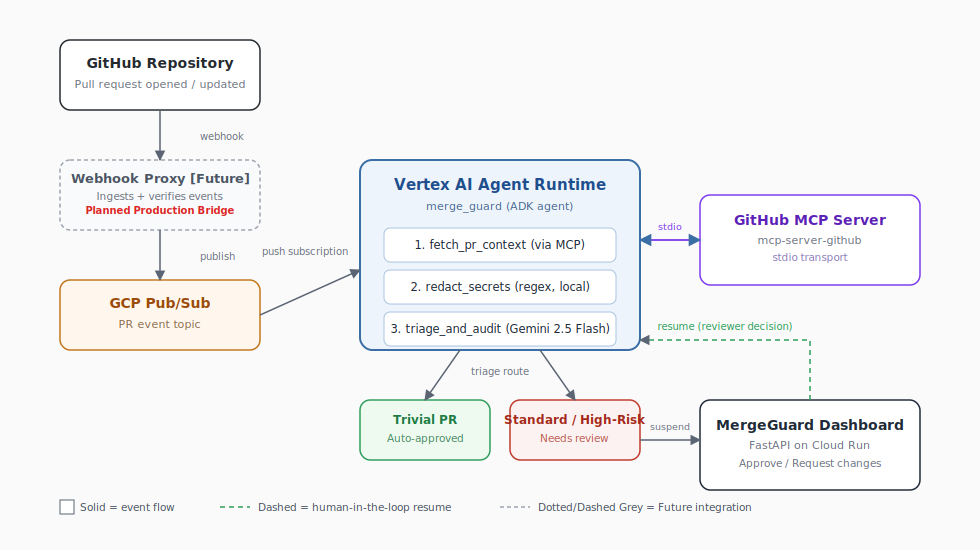

# MergeGuard

MergeGuard is an event-driven, autonomous AI quality gate designed as a Proof-of-Concept (PoC) prototype to address the code integration bottleneck in software engineering. Powered by the Google Agent Development Kit (ADK) and deployed on Google Cloud Vertex AI Agent Runtime, MergeGuard acts as a quality gate inside the existing workflow: it monitors incoming pull requests, handles low-risk changes with deterministic rules, and escalates higher-risk PRs through security checks, LLM-based quality analysis, and a human-in-the-loop approval step.

*   **Video Walkthrough**: [YouTube Demonstration](https://www.youtube.com/watch?v=jlAZ-JQJeuc)

---

## The Problem: Reviewing AI-Generated Code at Scale

AI code assistants (Gemini Code Assist, GitHub Copilot, and Claude Code) have sharply increased how fast developers can generate code. Pull request review has become the bottleneck.

CI pipelines can verify that code compiles, passes lint, or runs existing tests. They cannot determine whether:
*   New code paths are missing unit or integration test coverage
*   A change introduces an architectural regression risk
*   An API endpoint lacks input validation, exposing SQL injection or RCE vectors
*   A dependency change introduces a performance regression

Reviewers end up treating every PR the same, regardless of risk, which increases review latency and reviewer fatigue, and lets real issues slip through.

### Real-World Context: The Rise of Autonomous Code Agents
The urgency of this bottleneck is highlighted by recent policy shifts in major open-source projects. For example, Hugging Face recently enacted a strict **Code Agent Policy** due to their maintainers being overwhelmed by automated pull requests:

> **Hugging Face Transformers - Code Agent Policy:**
> *"The Transformers repo is currently being overwhelmed by a large number of PRs and issue comments written by code agents. We are currently bottlenecked by our ability to review and respond to them. As a result, we ask that new users do not submit pure code agent PRs at this time... PRs that appear to be fully agent-written will probably be closed without review..."*

MergeGuard addresses this exact crisis by acting as a semi-autonomous gatekeeper. Instead of flatly banning agent contributions, MergeGuard dynamically triages, classifies risk, and automates the baseline validation of incoming PRs, so human maintainers can focus only on changes flagged as requiring human review.

---

## Solution & Architecture

MergeGuard wraps LLM reasoning in an agent workflow that fetches codebase context, evaluates the change semantically, flags quality gaps, and holds higher-risk PRs for manual approval instead of auto-merging or auto-rejecting.



---

## Course Key Concepts Demonstrated

| Applied Key Concept | Implementation Details |
| :--- | :--- |
| Agent / Multi-Agent (ADK) | Built on the Google Agent Development Kit (ADK 2.0). Implements stateful workflow graphs, custom Pydantic schemas, and dynamic execution routing. |
| Model Context Protocol (MCP) | Connects dynamically to the GitHub MCP server (`mcp-server-github`) over a local stdio transport process inside the agent runtime to fetch PR files and diffs. |
| Security Features | Implements local client-side regex-based credential redaction before prompt submission to prevent secret leaks, and utilizes keyless GCP Workload Identity Federation (OIDC) auth. |
| Deployability | Deployed as a scalable Vertex AI Reasoning Engine (backend graph) and a serverless GCP Cloud Run container (glassmorphic human-in-the-loop dashboard). |
| Agent Skills (CLI) | Utilizes customized workspace skills configured under the `.agents/skills/` directory (`code-review`, `database-schema-validator`) that directly interface with our Antigravity assistant. |

---

## How It Works: The End-to-End Workflow

1.  **Ingestion:** A pull request event triggers a GitHub webhook, received by a webhook proxy and published to a GCP Pub/Sub topic.
2.  **Asynchronous Ingestion:** The Pub/Sub topic pushes the payload to the Backend Gateway (FastAPI server), which authenticates and invokes the **Vertex AI Agent Runtime** (Reasoning Engine) to initialize a new session and execute the triage graph.
3.  **MCP Context Gathering (All PRs):** The agent's `fetch_pr_context` node opens an MCP client session against `@modelcontextprotocol/server-github` over stdio to retrieve PR metadata (title, description, author), the list of modified files, and the patch diff.
4.  **Client-Side Secret Redaction:** Before any code reaches the LLM, a deterministic redaction pass scans the diff for exposed Google API keys, JWT tokens, AWS keys, and private key blocks, replacing matches with redaction tokens (e.g. `[REDACTED_GOOGLE_API_KEY]`).
5.  **Triage and Risk Routing:**
    *   **Low Risk (Auto-Approve):** Non-functional files only (`.md`, `.txt`, `.yaml`, `.json`, `.lock`), a trivial commit prefix (`docs:`, `chore:`, `style:`, `formatting:`), and <= 5 files / <= 50 lines changed. These skip the LLM audit and auto-approve.
    *   **High Risk:** Anything touching code, config, or dependencies goes to the semantic audit.
6.  **Semantic Audit (Gemini 2.5 Flash):** The audit node runs gemini-2.5-flash, guided by repository-level Agent Skills (`testing-gaps`, `security-auditing`, `performance-leaks`). Output is validated against a Pydantic schema (`PRAnalysisOutput`) covering:
    *   Testing gaps: missing unit/integration coverage on new functions
    *   Security concerns: e.g. SQL injection, RCE vectors
    *   Performance/regression risk: stability impact on existing behavior, latency, memory leaks, or thread hangs
7.  **Scoring and Review Routing:** The agent scores testing, security, and performance/regression risk (1-10 each) and averages them into an overall quality score. Non-trivial PRs yield a `RequestInput` event (`review_decision`), suspending the Vertex AI Agent Runtime session pending human input.
8.  **Review Dashboard:** Suspended sessions surface in the MergeGuard Dashboard (FastAPI on Cloud Run), where a reviewer can see the audit summary and scores, the raw diff, and an override panel to approve or request changes. That decision resumes the suspended agent session.

---

## Project Structure

```
merge-guard/
├── merge_guard/             # Core agent backend package
│   ├── agent.py               # Main agent workflow logic, nodes, and prompts
│   ├── fast_api_app.py        # Local FastAPI gateway (A2A & Reasoning Engine routes)
│   └── app_utils/             # telemetry, auth, and routing helpers
├── frontend/                # Live Dashboard (Cloud Run frontend service)
│   ├── main.py                # FastAPI frontend server and HTML UI templates
│   └── logo.png               # Dashboard brand asset
├── doc/                     # Documentation files
│   └── mergeguard_architecture.svg # Architecture diagram
├── deployment/
│   ├── github_webhook_forwarder.py # Cloud Function Webhook proxy forwarder
│   └── terraform/             # Terraform infrastructure configurations
├── tests/                     # Unit, integration, and evaluation suites
├── GEMINI.md                  # AI-assisted development guidelines
└── pyproject.toml             # Project dependencies and configurations
```

---

## Requirements & Local Setup

Ensure you have installed:
- uv (Python package manager)
- google-agents-cli (`uv tool install google-agents-cli`)
- Google Cloud SDK (Logged in via `gcloud auth login`)

### 1. Installation
Install project dependencies using the CLI helper:
```bash
agents-cli install
```

### 2. Local Development (Playground)
Launch the local interactive agent playground (auto-reloads on save):
```bash
agents-cli playground
```

### 3. Run Test Suite
Run local unit and integration tests:
```bash
uv run pytest tests/unit tests/integration
```

---

## Deployment & Testing

### 1. Deploying the Backend Agent (Vertex AI Reasoning Engine)
To deploy the reasoning engine backend workflow graph to Vertex AI Agent Runtime:
```bash
agents-cli deploy --project <your-project-id> --region us-central1
```

### 2. Deploying the Dashboard (Cloud Run)
To deploy the FastAPI human-in-the-loop triage dashboard to Google Cloud Run:
```bash
gcloud run deploy merge-guard-dashboard \
  --source frontend \
  --project <your-project-id> \
  --region us-central1 \
  --set-env-vars="AGENT_RUNTIME_ID=<your-agent-engine-id>,GOOGLE_CLOUD_PROJECT=<your-project-id>" \
  --allow-unauthenticated
```

### 3. Testing Ingestion via Pub/Sub
Use the gcloud SDK to manually simulate GitHub push events to Pub/Sub, wrapped in the Reasoning Engine REST API input schema:

```bash
gcloud pubsub topics publish github-pr-events \
  --project <your-project-id> \
  --message='{"input": {"message": "{\"repository\": \"example-owner/example-repo\", \"pull_request\": {\"number\": 3391}}"}}'
```

---

## Prototype Scope, Limitations & Future Work

As a Proof-of-Concept prototype, MergeGuard operates under several scoped constraints:

### Current Prototype Limitations:
1.  **Read-Only Operations:** The prototype performs PR analysis and registers manual overrides on the dashboard, but does not write reviews, comments, or approvals back to the live GitHub repository timelines.
2.  **Personal Access Token Scope:** Authentication with GitHub relies on a developer's Personal Access Token (`GITHUB_TOKEN`), which is subject to standard rate-limiting (5,000 requests/hour) and scope boundaries.
3.  **Local Redaction Fallback:** The secret redaction check runs client-side using deterministic regex pattern matching instead of a fully fledged cloud DLP (Data Loss Prevention) service.

### Production Roadmap:
*   **Verified Webhook Ingestion:** Transition from manual Pub/Sub simulator triggers to automated GitHub Webhook ingestion verified via HMAC-SHA256 signature headers inside a Google Cloud Function proxy.
*   **Write-Back Integration:** Implement automated webhook actions to post approved review comments, security audit alerts, and merge triggers directly to the GitHub Pull Request timeline.
*   **GitHub App Transition:** Migrate authentication to a dedicated GitHub App configuration using dynamic, short-lived installation access tokens.
*   **GCP Secret Manager Integration:** Replace environment-based token loading with secure Secret Manager mount configurations.
